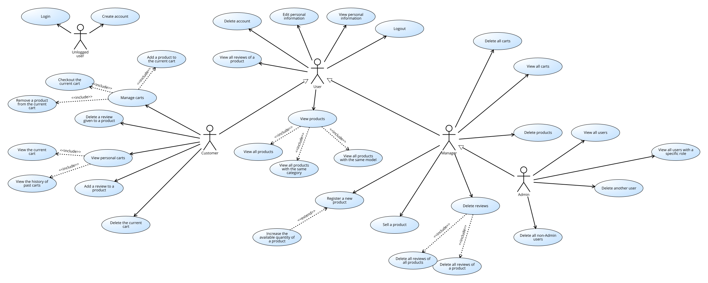
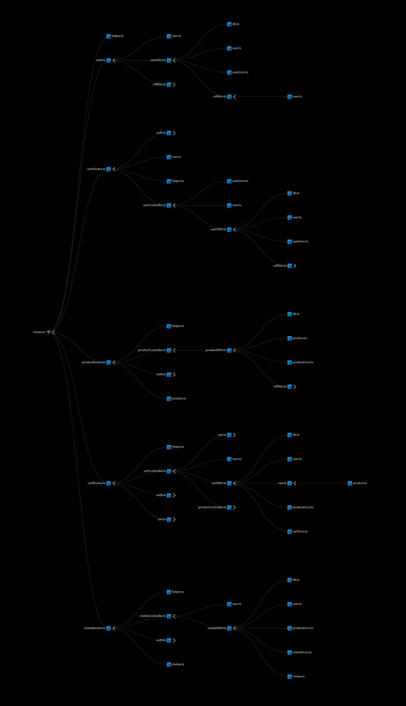

# EZelectronics - Software Engineering & Architecture Project ⚙️🛒

**EZelectronics** is a full-stack e-commerce management system developed collaboratively by myself and three other international students <!--[cite: 10]-->. 

It is a software application designed to help managers of electronics stores to manage their products and offer them to customers through a dedicated website <!--[cite: 10]-->. Managers can assess the available products, record new ones, and confirm purchases <!--[cite: 10]-->. Customers can see available products, add them to a cart and see the history of their past purchases <!--[cite: 10]-->.

While this repository contains a fully functional application (React + Node.js), its primary purpose is to showcase the **rigorous Software Engineering methodologies, teamwork procedures, and Quality Assurance processes** applied throughout the software development lifecycle.

## 📐 Software Engineering Methodology

The project was developed using an iterative approach, moving from an initial legacy analysis to a robust, secure future implementation <!--[cite: 8]-->.

*   **Requirements Engineering:** Extensive documentation was produced, including Stakeholder analysis, Personas and User Stories (e.g., mapping needs for Customers and Store Managers) <!--[cite: 6, 10]-->.
*   **UML Modeling:** The system architecture and user interactions were modeled using Context Diagrams, Use Case Diagrams, and Deployment Diagrams <!--[cite: 6, 7]-->.

  
   
  <em>System Use Case Diagram (V2)</em>

*   **Defect Tracking & Refactoring:** We performed reverse engineering on a V1 legacy system, identifying critical security defects (e.g., APIs lacking authentication) <!--[cite: 6]-->. In the V2 iteration, these vulnerabilities were addressed by introducing Role-Based Access Control (RBAC) with a new **Admin** role <!--[cite: 6, 7]-->.
*   **Time Management:** The development process was tracked using Gantt charts and detailed Time Estimation sheets.

> 📁 **Further Documentation**
> For a deep dive into our software engineering process, please explore the `docs/` directory. It contains all our project artifacts, including the **Test Report**, **Requirements Documents (V1 & V2)**, **API Specifications**, and **GUI Prototypes** <!--[cite: 2, 3, 4, 5, 6, 7]-->.
---

## 🧪 Quality Assurance & Testing Strategy

A massive focus of this project was placed on software quality and **Test-Driven Development (TDD)**. We adopted a mixed integration strategy to ensure the reliability of the system <!--[cite: 2]-->.

  
   
  <em>Component Dependency Graph for Integration Testing</em>

### 1. The 3-Step Integration Approach <!--[cite: 2]-->
*   **Step 1: Unit Testing:** Individual components (Controllers and DAOs) were isolated and tested to ensure database operations and logic functioned correctly <!--[cite: 2]-->.
*   **Step 2: API Route Testing:** Endpoints were tested to verify correct integration with controllers, including request validation and authentication middlewares <!--[cite: 2, 3]-->.
*   **Step 3: Full Integration Testing:** End-to-end validation of the system, testing complete user flows from authentication to database modification <!--[cite: 2]-->.

### 2. Testing Techniques Used <!--[cite: 2]-->
*   **White-Box Testing:** Used for Unit tests (achieving high Statement Coverage) <!--[cite: 2]-->.
*   **Black-Box Testing:** Applied to API and Integration tests using **Equivalence Partitioning** and **Boundary Value Analysis** (e.g., testing `409 Conflict` on duplicate users, `422 Unprocessable Entity` on boundary violations) <!--[cite: 2]-->.
*   **Traceability:** Every functional requirement (FR) is explicitly mapped to specific test cases to guarantee 100% test coverage <!--[cite: 2]-->.

---

## 🤝 Teamwork & CI/CD Practices

The project simulates a real-world enterprise workflow:
*   **Collaboration:** Developed within a structured group using Git for version control. Final delivery and feature integrations were managed through strict **Merge Requests** into the `main` branch <!--[cite: 9]-->.
*   **Containerization:** The entire stack (Client, Server, Database) is containerized using **Docker** and orchestrated via `docker-compose`, ensuring absolute consistency across development environments.
*   **Continuous Integration:** Automated pipelines were set up via GitLab CI to run the comprehensive Jest test suite on every commit, preventing regressions.

---

## 🛠️ Tech Stack

*   **Backend:** Node.js, Express.js, TypeScript
*   **Database:** SQLite3
*   **Frontend:** React.js, HTML/CSS
*   **QA & DevOps:** Jest, Docker, Docker Compose, GitLab CI

---

## ⚙️ How to Run Locally

### 🐳 Run with Docker (Recommended)
The project is configured for a quick and clean startup using Docker <!--[cite: 1]-->.

1.  **Clone the repository:**
    \`\`\`bash
    git clone https://github.com/gnnrsc/ezelectronics.git
    cd ezelectronics-management-system
    \`\`\`

2.  **Build and start the containers:**
    \`\`\`bash
    docker-compose up --build
    \`\`\`
    *(Note: use `docker compose up --build` if you are using Docker Desktop V2).*

### 💻 Run without Docker (Manual Setup)
If you prefer to run the application natively, you will need two separate terminal windows.

**1. Start the API Server:**
\`\`\`bash
cd code/server
npm install
npm start
\`\`\`
*(To run the backend test suite, simply run `npm test` inside the `code/server` directory).*

**2. Start the Client UI:**
Open a **new** terminal window and run:
\`\`\`bash
cd code/client
npm install
npm start
\`\`\`

**Access the application:**
*   Client UI: `http://localhost:3000`
*   API Server: `http://localhost:3001`
